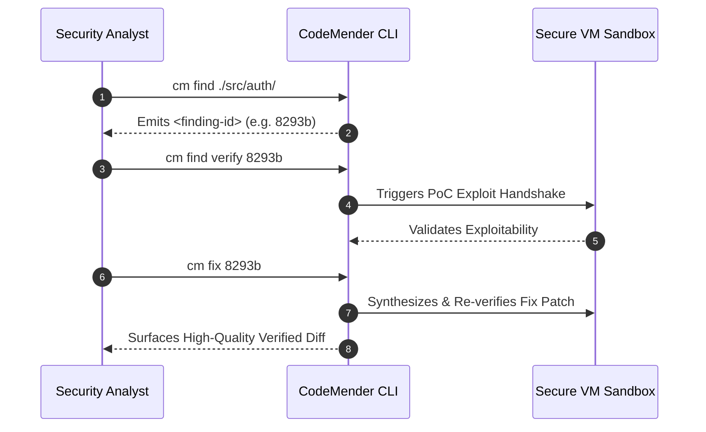

# CodeMender CLI: Enterprise VPC & Private Service Connect (PSC) Automation

This modular, Terraform configuration automates the fully secure networking, identity, and execution environment defined in the **CodeMender CLI (Early Access Program): VPC & Private Service Connect Setup Guide**.

By deploying this stack, all outbound traffic from your compute environments to Google Cloud APIs (`*.googleapis.com`) routes exclusively over Google's internal network infrastructure using a dedicated **Private Service Connect (PSC)** bundle endpoint.

---

## 🏗️ Architecture & Core Pillars

```mermaid
graph TD
    subgraph EnterpriseProject ["Enterprise Project & Isolation"]
        APIs["Google APIs Enablement"]
        
        subgraph IsolatedVPC ["Your Isolated VPC"]
            VM["Shielded Host VM"]
            DNS["Private Cloud DNS Zone"]
        end

        subgraph NetworkServices ["Network Services"]
            PSC["Global PSC Forwarding Rule"]
        end
    end

    subgraph SecureBackbone ["Google Secure Backbone"]
        GCP["Google Cloud APIs & Services"]
    end

    APIs -.->|"Enforces Readiness"| VM
    VM -->|"DNS Override"| DNS
    VM -->|"TCP 443 Egress Allow"| PSC
    PSC -->|"Fully Private Path"| GCP

    style APIs fill:#1a202c,stroke:#a0aec0,stroke-width:2px
    style VM fill:#2d3748,stroke:#4299e1,stroke-width:2px
    style DNS fill:#2d3748,stroke:#48bb78,stroke-width:2px
    style PSC fill:#2b6cb0,stroke:#ecc94b,stroke-width:2px
    style GCP fill:#276749,stroke:#68d391,stroke-width:2px
```



### 1. Automatic Project Provisioning
- **Project Factory Integration**: Creates a new, isolated Google Cloud project with billing association and API activation using the Google Project Factory module.
- **Zero-Touch API Activation**: Activates essential GCP APIs (`compute`, `dns`, `iam`, `networkservices`) automatically.

### 2. Networking
- **Custom VPC Network**: Establishes a custom mode VPC (`codemender-vpc`).
- **Private Google Access**: Configures a dedicated subnetwork (`10.0.0.0/24`) with `private_ip_google_access = true` enforced.

### 3. Private Service Connect
- **Global Internal Address**: Allocates a static internal global address (`10.128.0.50`).
- **Compliant Naming**: Provisions a Global Forwarding Rule named `codemenderpsc`, conforming to Google's 1–20 lowercase letters/numbers rule.

### 4. Secure Firewall Posture
- **Priority 900 (`allow-internal-and-psc-egress`)**: Exclusively permits HTTPS (TCP 443) egress from `isolated-vm` instances to the PSC IP address (`10.128.0.50/32`).
- **Priority 1000 (`deny-internet-egress`)**: Blocks all general external internet egress (`0.0.0.0/0`), preventing data exfiltration.
- **Priority 1000 (`allow-ssh-ingress-from-iap`)**: Permits secure administration SSH access exclusively via Cloud IAP (`35.235.240.0/20`).

### 5. DNS Override
- **Private Managed Zone**: Creates a Cloud DNS private zone (`psc-googleapis-zone`) bound to your VPC.
- **Transparent Routing**: Provisions **A** (`googleapis.com.`) and **CNAME** (`*.googleapis.com.`) record sets targeting your internal PSC IP address.

### 6. Org-Policy Compliant Host
- **Shielded VM Enforcement**: Pre-configured with **Secure Boot**, **vTPM**, and **Integrity Monitoring** enabled to seamlessly pass organization policies (`constraints/compute.requireShieldedVm`).
- **Completely Private**: Operates without external IPs using a dedicated least-privilege Service Account.

---

## 📁 Repository Structure

| File | Primary Function |
| :--- | :--- |
| **`main.tf`** | Consolidated configuration that creates the GCP project, network, DNS, firewalls, and compute resources. |
| **`variables.tf`** | Documented variables supporting project creation and custom IP layouts. |
| **`outputs.tf`** | Emits network details, validation commands, and dynamic SSH prompts. |
| **`versions.tf`** | Configures Terraform version constraints and providers supporting offline execution. |

---

## 🚀 Deployment Instructions

### 1. Configure Variables
Copy the variable template file:

```bash
cp terraform.tfvars.example terraform.tfvars
```

Edit `terraform.tfvars` and set the project name/ID, billing account, and any optional folder/organization IDs:
```hcl
project_id      = "your-desired-project-id"
billing_account = "ABCDE-FGHIJK-LMNOPQ"

# Optional configurations
# folder_id       = "9876543210"
# org_id          = "1234567890"
# random_project_id = true
```

### 2. Plan and Apply
```bash
terraform init
terraform plan -out=tfplan
terraform apply tfplan
```

---

## 🧪 Verification & Validation Workflows

Once the Terraform successfully finishes applying, validate the secure network path using your isolated Compute Engine instance:

### Step 1: Securely SSH via Identity-Aware Proxy (IAP)
Run the dynamic gcloud connection string emitted in your Terraform outputs:

```bash
gcloud compute ssh codemender-cli-host \
  --zone=us-central1-a \
  --tunnel-through-iap
```

### Step 2: Confirm Internal Resolution via `curl`
Execute a verbose curl call to verify traffic resolves to the PSC address (`10.128.0.50`):

```bash
curl -v https://storage.googleapis.com
```

**✅ Expected Handshake Output**:
Notice that the request routes directly to your private internal static IP:
```text
* Connected to storage.googleapis.com (10.128.0.50) port 443 (#0)
```

### Step 3: Verify Secure Web Proxy for Debian Repositories (Optional)
If you deployed the optional Secure Web Proxy by setting `enable_secure_web_proxy = true`, configure the proxy environment variables inside your VM to test connection limits:

```bash
# Apply proxy configurations (replace <SECURE_WEB_PROXY_IP> with the output value)
export http_proxy="http://<SECURE_WEB_PROXY_IP>:80"
export https_proxy="http://<SECURE_WEB_PROXY_IP>:443"

# Verify that allowed Debian package repository URLs are accessible
curl -I https://deb.debian.org

# Confirm that blocked URLs (e.g., google.com) are rejected by the proxy policy
curl -I https://google.com
```

---

## 📦 CodeMender VM Installation & Operation Guide (EAP)

Once internal network routing is fully verified, follow these official onboarding procedures from the **CodeMender: EAP Instructions** guide to install and operate the autonomous agent.

### 1. VM Installation & Build Dependencies
Inside your verified host VM (`codemender-cli-host`):

1. **Download the CLI Client**:
   Download the pre-compiled binary utilizing the authenticated download link provided in your onboarding package (which incorporates your unique `Aiza...` API key).
2. **Transfer Project Source Code**:
   Clone or copy your target codebase directly onto the VM (e.g., under `~/projects/`).
3. **Install Build Tools**:
   Ensure all native dependencies, compilers, or build systems required by your target repository (e.g., `make`, `npm`, `pip`, `blaze`) are installed locally on the VM.
4. **Initial Verification**:
   Run the environment handshake verification suite:
   ```bash
   cm init --verify
   ```
   Confirm that all server handshakes return green checkmarks next to **Server Connectivity**.

---

### 2. Project Configuration (`~/.codemender/config.yaml`)

Configure your execution parameters by editing `~/.codemender/config.yaml`:

```yaml
# 1. Version Control System (Required)
vcs:
  type: "git" # Supported: "git", "mercurial", or "custom"
  # If type is "custom", supply required vcs handlers:
  # commands:
  #   reset: "svn revert -R ."
  #   status: "svn status"
  #   diff: "svn diff"
  #   stage: "echo 'no staging needed'"

# 2. Autonomous Verification Command
build:
  command: "make test" # Sandboxed command triggered to prove patch safety

# 3. Target Codebase Boundaries
project_paths:
  - "/home/admin/projects/my-app"
```

> [!IMPORTANT]  
> You **must** explicitly configure the `vcs.type`. Leaving this field blank will cause structural scan failures.

---

### 3. Vulnerability Remediation Lifecycle



#### Phase A: Scan & Discover (`cm find`)
Execute targeted scans across specific subcomponents (recommending batches of 10–50 files):
```bash
cm find ./src/auth/          # Scan a specific component directory
cm find ./src/auth/login.py  # Scan an isolated critical file
cm find ./src -y             # Bypass interactive confirmation prompts
```

#### Phase B: Verify Exploitability (`cm find verify`)
Synthesizes and runs an active Proof-of-Concept (PoC) exploit to confirm true exploitable state:
```bash
cm find verify <finding-id>
cm find verify 8293b --skip-exploit        # Validate analysis without executing active PoC
cm find verify 8293b -c "Focus on OAuth"   # Supply custom contextual prompt instructions
```

#### Phase C: Sandboxed Remediation (`cm fix`)
Generates, compiles, executes regression builds, and applies functionally correct patches:
```bash
cm fix <finding-id>
cm fix 8293b --auto-apply   # Automatically commit validated patch directly
cm fix 8293b --no-cache     # Force cold generation of a new remediation candidate
```

#### Phase D: Inspection & Reporting (`cm report`)
Review detailed security walkthrough artifacts and patches:
```bash
cm report --patches                   # Output standard patch diffs
cm report --format html --open        # Generate and automatically open HTML audit report
```

---

### 4. Quotas & Session Management

#### Managing Active Sessions
CodeMender tracks ongoing scan/verify/fix sessions. **Only one session can be active per project at a time.**
```bash
cm session list           # Display active sessions and their lifecycle status
cm session cancel <id>    # Abort a conflicting or hanging session
cm session resume <id>    # Continue a suspended verification run
```

#### Quotas & Payload Limits
- **Rate Limits**: 600 Queries Per Minute (QPM) and 432,000 calls per day.
- **Individual File Limit**: Files larger than **500 KB** are excluded by default (customizable via `max_file_size_kb`).
- **Aggregate Payload Limit**: Enforces a strict total request payload cap of **100 MiB**.
