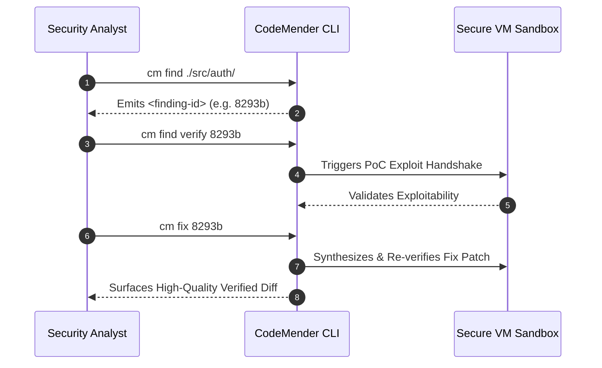

# CodeMender: Isolated Google Cloud Environment for Vulnerability Remediation

This modular, Terraform configuration automates an isolated Google Cloud environment for vulnerability remediation using CodeMender service.

By deploying this stack, all outbound traffic from CodeMender to Google APIs (`*.googleapis.com`) routes exclusively over Google's internal network infrastructure using a dedicated **Private Service Connect (PSC)** bundle endpoint.


## 🚀 Deployment Instructions

### 1. Configure Variables
Copy the variable template file:

```bash
cp terraform.tfvars.example terraform.tfvars
```

Edit `terraform.tfvars` and set the project name/ID, billing account, and any optional folder/organization IDs:
```hcl
project_id      = "your-desired-project-id"
billing_account = "ABCDE-FGHIJK-LMNOPQ"

# Optional configurations
# folder_id       = "1234567890"
# org_id          = "1234567890"
# random_project_id = true
```

### 2. Plan and Apply
```bash
terraform init
terraform plan -out=tfplan
terraform apply tfplan
```

---

## 🧪 Transfer Codemender Binary to GCE Host VM

```bash
gcloud compute scp ~/cm-linux codemender-cli-host:~ \
  --zone="$(terraform output -raw zone)" \
  --project="$(terraform output -raw project_id)" \
  --tunnel-through-iap
```

#### Collect output command to enable Secure Web proxy for APT and Git

```bash
echo "sudo tee /etc/apt/apt.conf.d/99proxy << 'EOF'
Acquire::http::Proxy \"http://$(terraform output -raw secure_web_proxy_ip):80\";
Acquire::https::Proxy \"http://$(terraform output -raw secure_web_proxy_ip):443\";
EOF
git config --global http.proxy http://$(terraform output -raw secure_web_proxy_ip):80
git config --global https.proxy http://$(terraform output -raw secure_web_proxy_ip):443"
```

### 3.Update Secure Web Proxy on GCE Host VM
```bash
gcloud compute ssh codemender-cli-host \
  --zone="$(terraform output -raw zone)" \
  --project="$(terraform output -raw project_id)" \
  --tunnel-through-iap
```

Paste in the output from the echo command from step 2 to enable Secure Web Proxy for secure downloads

Verify the Secure Web Proxy for apt installs is working with following command:

```bash
sudo apt update && sudo apt install -y git
```

Verify Google API traffic resolves to the Private address with the following command:

```bash
curl -v https://storage.googleapis.com
```


## 📦 CodeMender Runtime Configuration 

### 1. VM Installation & Build Dependencies
Inside your verified host VM (`codemender-cli-host`):

1. **Verify CLI Client in Home Directory**:
   Ensure `cm-linux` is located in your home directory (`~/cm-linux`) and make it executable:
   ```bash
   chmod +x ~/cm-linux
   ```
2. **Clone a repo to evaluate**:
   Clone the Juice repo https://github.com/juice-shop/juice-shop or another smaller public repo
   ```bash
   git clone https://github.com/juice-shop/juice-shop
   ```

3. **Install Build Tools**:
   Ensure all native dependencies, compilers, or build systems required by your target repository (e.g., `make`, `npm`, `pip`).
   ```bash
   sudo apt install -y make pip
   ```

4. **Initial Verification**:
   Run the environment handshake verification suite:
   ```bash
   sudo ln -s ~/cm-linux /usr/local/bin/cm
   cm init
   cm init --verify
   ```
   Confirm that all server handshakes return green checkmarks next to **Server Connectivity**.

5. **Edit Codemender configuration** 
Edit ~/.codemender/config.yaml to fit your environment. 
- vcs: allows you to set the version control system used for the project. We support git and mercurial. If you don’t use git or mercurial, you can use the “custom” vcs option and specify the vcs commands in the config. 
- build: specify the command you want the agent to use for building and testing the project
- project_paths: specify the source root of projects you want to use the codemender on. 
- tools: configuration related to confirmations for writes and tool executions

### 2. Vulnerability Remediation Lifecycle



## Codemender CLI commands

1. **Scan & Discover (`cm find`)**
Execute targeted scans across specific subcomponents (recommending batches of 10–50 files):
```bash
cm find ./src/auth/          # Scan a specific component directory
cm find ./src/auth/login.py  # Scan an isolated critical file
cm find ./src -y             # Bypass interactive confirmation prompts 
```

2. **Inspection & Reporting (`cm report`)**
Review detailed security walkthrough artifacts and patches:
```bash
cm report --patches                   # Output standard patch diffs
cm report --format html --open        # Generate and automatically open HTML audit report
```

3. **Verify Exploitability (`cm find verify`)**
Synthesizes and runs an active Proof-of-Concept (PoC) exploit to confirm true exploitable state:
```bash
cm find verify <finding-id>
cm find verify 8293b --skip-exploit        # Validate analysis without executing active PoC
cm find verify 8293b -c "Focus on OAuth"   # Supply custom contextual prompt instructions
```

4. **Sandboxed Remediation (`cm fix`)**
Generates, compiles, executes regression builds, and applies functionally correct patches:
```bash
cm fix <finding-id>
cm fix 8293b --auto-apply   # Automatically commit validated patch directly
cm fix 8293b --no-cache     # Force cold generation of a new remediation candidate
```


### 4. Quotas & Session Management

#### Managing Active Sessions
CodeMender tracks ongoing scan/verify/fix sessions. **Only one session can be active per project at a time.**
```bash
cm session list           # Display active sessions and their lifecycle status
cm session cancel <id>    # Abort a conflicting or hanging session
cm session resume <id>    # Continue a suspended verification run
```

#### Quotas & Payload Limits
- **Rate Limits**: 600 Queries Per Minute (QPM) and 432,000 calls per day.
- **Individual File Limit**: Files larger than **500 KB** are excluded by default (customizable via `max_file_size_kb`).
- **Aggregate Payload Limit**: Enforces a strict total request payload cap of **100 MiB**.
