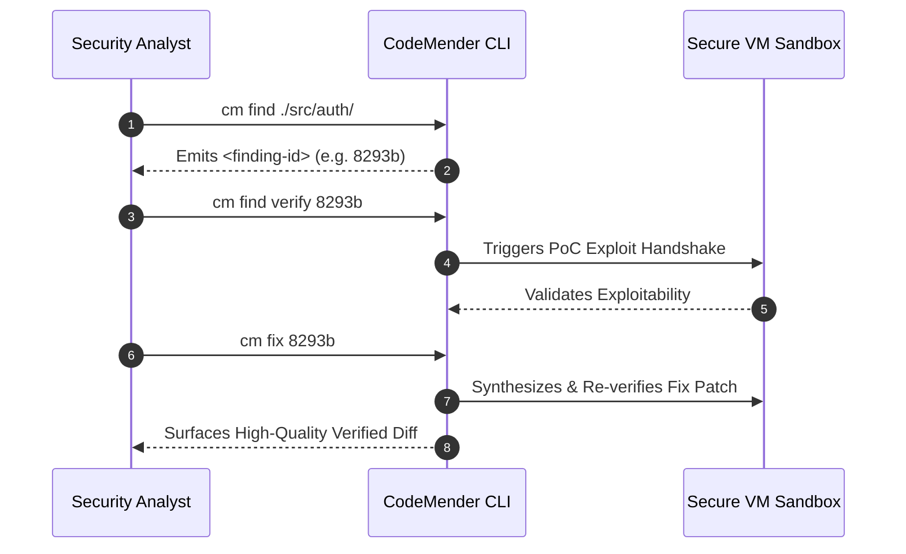

# CodeMender Vulnerability Remediation

This modular, a simple Terraform deployment automates an isolated Google Cloud environment for vulnerability remediation using CodeMender service.

## Features
- Isolated GCE VM for vulnerability remediation
- Secure Web Proxy for APT installs
- Private DNS zone for Google API access
- Cloud IAP for secure access


## Vulnerability Remediation Workflow



## 🚀 Infrastructure Deployment

### 1. Configure Variables
Copy the variable template file:

```bash
cp terraform.tfvars.example terraform.tfvars
```

Edit `terraform.tfvars` and set the project name/ID, billing account, and any optional folder/organization IDs:
```hcl
project_id      = "project-id-prefix"
billing_account = "ABCDE-FGHIJK-LMNOPQ"

# Optional configurations
# folder_id       = "1234567890"
# org_id          = "1234567890"
# random_project_id = true
```

### 2. Plan and Apply
```bash
terraform init
terraform plan -out=tfplan
terraform apply tfplan
```

---

## 🧪 CodeMender CLI on isolated GCE VM

### 1. Automatic Installation via Startup Script
The Compute Engine metadata startup script automatically downloads the CodeMender CLI (`cm`) package from Artifact Registry and installs it to `/usr/local/bin/cm` on VM boot.

If Secure Web Proxy is enabled (`enable_secure_web_proxy = true`), the proxy rules allow traffic to Debian repositories and GitHub, while all Google Cloud APIs (`*.googleapis.com`, including Artifact Registry for downloading the CodeMender CLI) route directly through the Private Service Connect (PSC) endpoint.

### 2. Manual Download Options (Reference)
If you need to manually download or update the CLI on the VM:

**Option A: Using `curl`**
```bash
curl -L -o cm-linux-amd64.zip \
  "https://artifactregistry.googleapis.com/download/v1/projects/cmoc-prod/locations/us/repositories/codemender-cli-production/files/cm%3Astable%3Acm-linux-amd64.zip:download?alt=media"

unzip -o cm-linux-amd64.zip
chmod +x cm
sudo mv cm /usr/local/bin/cm
```

**Option B: Using `gcloud CLI`**
```bash
gcloud artifacts generic download \
  --project=cmoc-prod \
  --location=us \
  --repository=codemender-cli-production \
  --package=cm \
  --version=stable \
  --name=cm-linux-amd64.zip \
  --destination=./

unzip -o cm-linux-amd64.zip
chmod +x cm
sudo mv cm /usr/local/bin/cm
```

### 3. SSH into isolated GCE VM
```bash
gcloud compute ssh codemender-cli-host \
  --zone="$(terraform output -raw zone)" \
  --project="$(terraform output -raw project_id)" \
  --tunnel-through-iap
```

*(Note: When `enable_secure_web_proxy = true`, the VM startup script automatically configures system-wide `/etc/apt/apt.conf.d/99proxy` and `/etc/gitconfig` proxy settings, and installs required development packages (`git`, `curl`, `build-essential`, `python3`, `pkg-config`, `nodejs`, `npm`, `unzip`) on boot.)*

### 4. Verify Connectivity & Tools (Optional)
Packages are installed automatically on startup when SWP is enabled. If you need to manually run the package installation or verify APT connectivity:

```bash
sudo apt update && sudo apt install -y git curl build-essential python3 pkg-config nodejs npm unzip
```

Verify Google API traffic resolves to the Private address via PSC:

```bash
curl -v https://storage.googleapis.com
```


## 📦 CodeMender Client configuration 

1. **Verify CLI Installation**:
   Verify that `cm` is available in your PATH:
   ```bash
   cm --version
   ```
2. **Clone a repo to evaluate**:
   Clone the Juice repo https://github.com/juice-shop/juice-shop or another public repo on GitHub.
   ```bash
   git clone https://github.com/juice-shop/juice-shop
   ```

3. **Initial Verification**:
   Run the environment handshake verification suite:
   ```bash
   cm init
   cm init --verify
   ```
   Confirm that all server handshakes return green checkmarks next to **Server Connectivity**.

4. **Edit Codemender configuration** 
Edit ~/.codemender/config.yaml to fit your environment. 
- vcs: Set the version control system used. We support git and mercurial. If you don’t use git or mercurial, you can use the “custom” vcs option. 
- build: Set the command the agent should use for building and testing.
- project_paths: Set the source root of projects you want to use Codemender on. 
- tools: Set configuration related to confirmations for writes and tool executions


## Codemender CLI Commands

1. **Scan & Discover (`cm find`)**
Execute targeted scans across specific subcomponents (recommending batches of 10–50 files):
```bash
cm find ./src/auth/          # Scan a specific component directory
cm find ./src/auth/login.py  # Scan an isolated critical file
cm find ./src -y             # Bypass interactive confirmation prompts 
```

2. **Inspection & Reporting (`cm report`)**
Review detailed security walkthrough artifacts and patches:
```bash
cm report --patches                   # Output standard patch diffs
cm report --format html --open        # Generate and automatically open HTML audit report
```

3. **Verify Exploitability (`cm find verify`)**
Synthesizes and runs an active Proof-of-Concept (PoC) exploit to confirm true exploitable state:
```bash
cm find verify <finding-id>
cm find verify 8293b --skip-exploit        # Validate analysis without executing active PoC
cm find verify 8293b -c "Focus on OAuth"   # Supply custom contextual prompt instructions
```

4. **Remediation (`cm fix`)**
Generates, compiles, executes regression builds, and applies functionally correct patches:
```bash
cm fix <finding-id>
cm fix 8293b --auto-apply   # Automatically commit validated patch directly
cm fix 8293b --no-cache     # Force cold generation of a new remediation candidate
```

5. **Bulk remediation** 
```bash
 for id in $(cm report --format json 2>/dev/null | jq -r '.[] | select(.Status == "OPEN") | .FindingID'); do echo "Processing fix for Finding ID: $id"; cm fix "$id" --yes; done
```

6. **Session Management**
```bash
cm session list           # Display active sessions and their lifecycle status
cm session cancel <id>    # Abort a conflicting or hanging session
cm session resume <id>    # Continue a suspended verification run
```

---

## 🧹 Clean Up Resources

To destroy all deployed infrastructure and resources when finished:

```bash
terraform destroy
```

